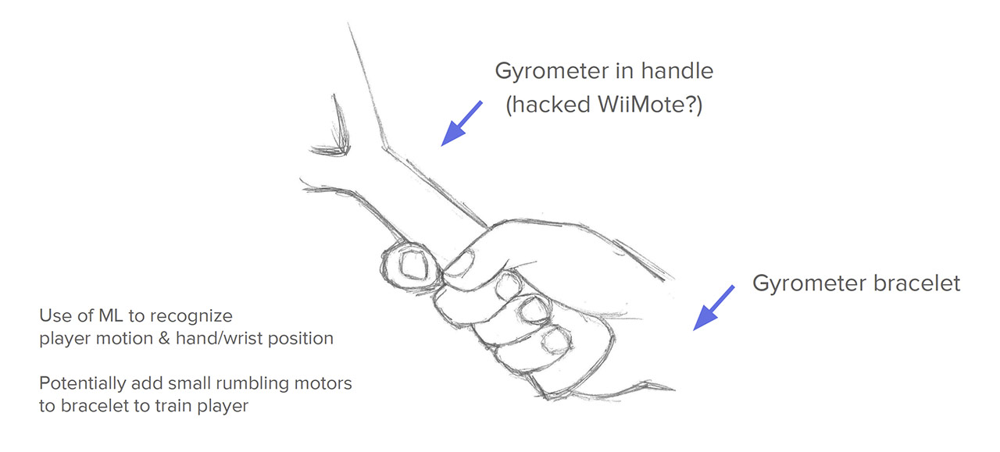

# Tennis Service Trainer

Sources of the Tennis Service Trainer project.

See the [project presentation slides](https://academia.jansensan.net/30853/tennis-service-trainer-wristband-presentation/).

## Collaborators

- [Mat JANSON BLANCHET](https://jansensan.net)
- [Pablo MONROY D'CROZ](https://www.linkedin.com/in/pamonroy/)
- [Natasha TYLOSKY](https://www.natashatylosky.com/)

## Usage

### Technical requirements

Ensure that you have [Processing](https://processing.org/) installed on your machine.

### Running the prototype

- Open `src/processing/proto_send_to_server/proto_send_to_server.pde`
- Open and run the server (see [the repository for details](https://github.com/jansensan/tennis-service-trainer-api))
- Run `proto_send_to_server.pde`
- Clicking on the interface elements sends OSC messages to the server:
  - The "Send OSC Test Message" button sends a simple integer to the server
  - Clicking on the "Start Recording" button will start tracking the mouse over the canvas and sending its positions to the server.
  - Clicking on "Stop Recording" will stop the mouse tracking. The server will also save the data to disk.

## Contribution

Read the [contribution guide](./contribution.md).